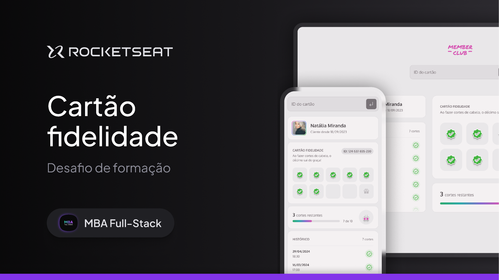
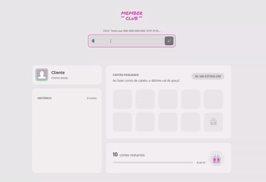

# Desafio Prático - Member Club ✂️
> Desenvolvimento de uma aplicação web responsiva de Cartão fidelidade: Member Club.
Projeto criado durante MBA da Rocketseat em 2024.

[FIGMA](https://www.figma.com/community/file/1380913092616830278)




## Preview da Aplicação  👨‍🎨



## Funcionalidades 👨‍💼
✅ HTML, estilização com CSS, Lógica de programação, conhecimentos básicos de JavaScript;
✅ Aplicação web deve ser responsiva;
✅ Simulação da API usando json-server;
✅ Busca de informações de clientes por ID com validação de existência;
✅ Alerta de erro em tela para IDs inválidos.

## Cenários
✅ Exibição da imagem, nome e histórico de cortes do cliente.
✅ Marcação de cortes no cartão fidelidade do cliente.
✅ Acompanhamento do progresso para o próximo prêmio.
✅ Aviso de "Próximo corte gratuito!" ao atingir 10 cortes. (DICA: Use 444-444-444-444)

## Como rodar o projeto 🚀
```bash
npm install # para instalar as dependências

npm run dev # para rodar a aplicação web
npm run server # para rodar o servidor

```
